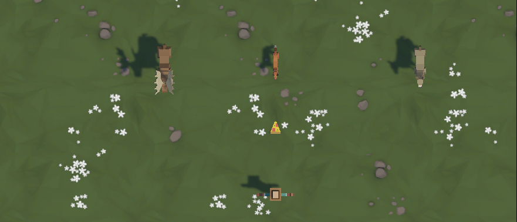

# 🐾 Feed the Animals – Unity CWC Prototype 2

> A playful top-down shooter where food flies and animals stampede!  
> Developed as part of Unity’s **Create With Code** pathway – my second fully completed prototype.  
> Built, polished, and pushed to GitHub in a single session. 🧠🎯

---

  
   <em>Pizza-powered peacekeeping – gameplay screenshot 🍕🦁</em>

---

## 🎮 Game Overview

In **Feed the Animals**, you play a stationary launcher defending your spot from waves of hungry animals charging your way.  
Your only weapon? Unlimited pizza (or projectiles of your choice)! 🍕

This prototype taught me how to:
- Fire objects from the player
- Randomly spawn and manage enemy objects
- Use **object pooling** to reduce overhead
- Detect and destroy game objects on collision

---

## 🧠 Key Concepts Applied

| Concept | Implementation |
|--------|----------------|
| **Input Handling** | Pressing `Space` to fire projectiles |
| **Prefab Instantiation** | Animals and food objects dynamically spawned |
| **Randomization** | Animal spawn positions and intervals |
| **Collision Detection** | Destroying animal + food on contact |
| **Object Pooling** | For optimized reuse of prefabs |
| **Script Organization** | Clean, modular C# scripts |

---

## 🛠️ Tech Stack

- **Engine:** Unity 2022.x (3D Core Template)
- **Language:** C#
- **IDE:** Visual Studio Code
- **Version Control:** Git & GitHub

---

## 📸 Screenshot

  

> You can replace this placeholder with your actual screenshot and rename the image as needed.

---

## 📁 File Structure (Simplified)

Assets/
┣ Scripts/
┃ ┣ PlayerController.cs
┃ ┣ Projectile.cs
┃ ┣ SpawnManager.cs
┃ ┗ ObjectPool.cs
┣ Prefabs/
┣ Scenes/
┗ Materials/

---

## 📦 Build Status

| Feature | Status |
|--------|--------|
| Core Mechanics | ✅ Complete |
| Object Pooling | ✅ Implemented |
| Challenge + UI | ⏳ Later |
| GitHub Upload | ✅ Done |
| README + Screenshot | ✅ Done |

---

## 📜 License

This is a personal learning project and part of the **Unity Create With Code** curriculum.  
Feel free to fork or explore, but please don’t submit as your own coursework.

---

## 👨‍💻 Author

**Anirban Ghosh**  
Unity Indie Dev | Coder | Dreamer | Doer  
🌐 [GitHub](https://github.com/AnirbanGhosh2503)

---

> 🧩 This is the second prototype in my journey to complete all 5 CWC games and eventually build original Unity-based projects.  
> ✨ *Prototype 3 coming up next...*

